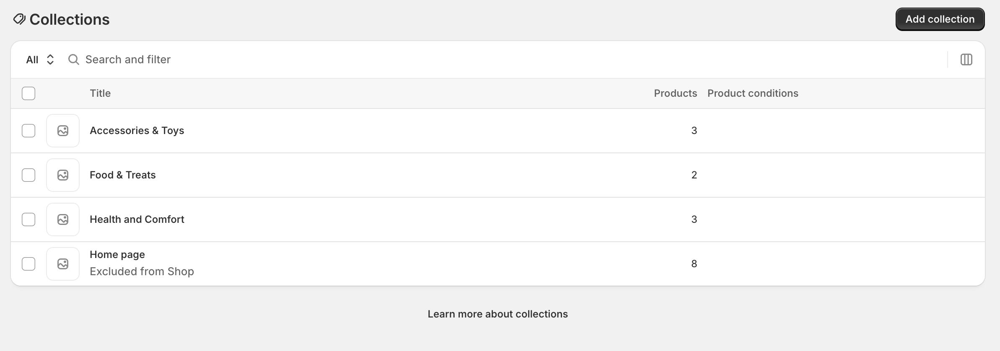
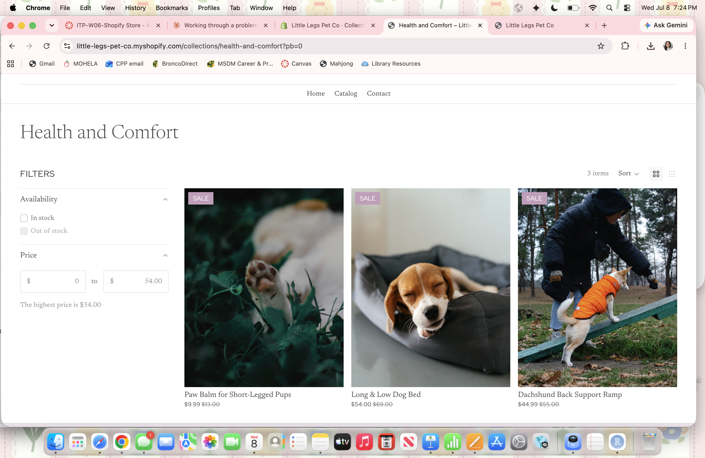
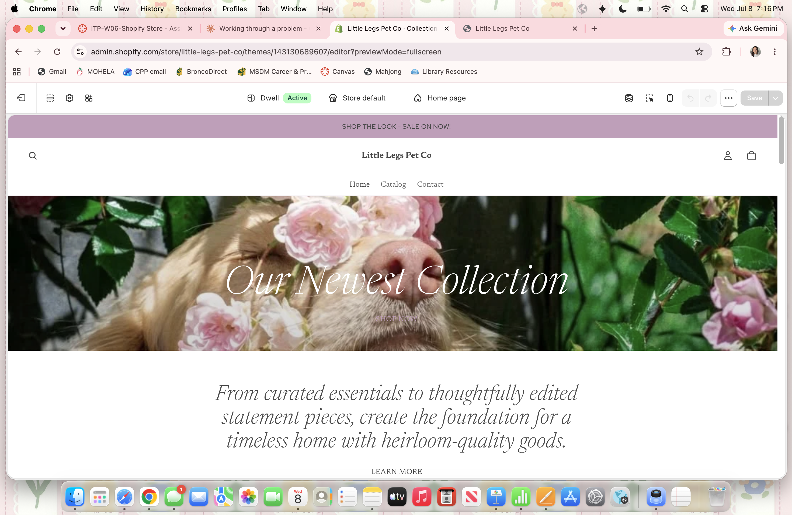

## Introduction

This report documents the collections and navigation structure built for **Little Legs Pet Co.**, my Shopify practice store, as part of Assignment 4. The goal of this assignment was to organize the store's catalog so that customers, dachshund owners, can browse quickly and intuitively, and to connect that organization to the CPP Farm Store consulting project.

::: callout-note
## Store context

Little Legs Pet Co. sells products designed specifically for dachshunds and other long-backed, short-legged breeds, including mobility support items, food, and accessories.
:::

## Collections / Categories {#sec-collections}

I created three collections in the Shopify admin, organized around *why* a customer is shopping rather than a flat, alphabetical product list. This need-state approach is explained further in @sec-merchandising.

::: panel-tabset
## Health & Comfort

Products addressing dachshund-specific spinal and joint support.

- Dachshund Back Support Ramp (LLPC-RAMP-003)
- Long & Low Dog Bed (LLPC-BED-002)
- Paw Balm for Short-Legged Pups (LLPC-BALM-007)

## Food & Treats

Consumable nutrition and dental items.

- Dachshund Dental Chews, 30-count (LLPC-DENTAL-008)
- Organic Grain-Free Dachshund Bites (LLPC-FOOD-005)

## Accessories & Toys

Everyday wear and play items.

- Little Legs Squeaky Hot Dog Toy (LLPC-TOY-004)
- Sausage Dog Bandana, 3-Pack (LLPC-BNDNA-006)
- The Classic Wiener Harness (LLPC-HARNESS-001)
:::

### Screenshot: Collections in Shopify Admin

### Screenshot: Collection Pages on the Storefront

## Navigation Menu {#sec-navigation}

I revised the store's main menu so the three collections are one click away from any page, alongside a full catalog link and standard store pages.

**Main menu structure:**

1.  Home
2.  Shop All
3.  Health & Comfort
4.  Food & Treats
5.  Accessories & Toys
6.  About Us

### Screenshot: Main Navigation on the Storefront

## Merchandising Logic {#sec-merchandising}

I organized Little Legs Pet Co.'s catalog around the customer's shopping *intent* rather than a generic product-type taxonomy. A dachshund owner searching for solutions to their pet's back or joint issues can go straight to Health & Comfort and find the ramp, the bed, and the balm together, even though those are technically different product categories (equipment, furniture, and skincare). Similarly, someone restocking food or dental care lands in Food & Treats, and someone shopping for everyday gear or gifts lands in Accessories & Toys. This mirrors how real pet owners think about their needs by occasion and concern, not by SKU type and it reduces the number of clicks needed to find a relevant product.[^1]

[^1]: This need-state grouping approach is common in specialty pet e-commerce, where health-related purchases are often driven by a specific concern rather than general browsing.

## Customer Experience {#sec-cx}

The three-collection navigation structure keeps the shopping path short: a customer never needs more than one click from the homepage to reach a relevant product grouping, and no collection is so large that it becomes difficult to scan. Because the collections are named around outcomes ("Health & Comfort") rather than internal categories ("Equipment"), first-time visitors can self-select the right section even if they don't know Little Legs Pet Co.'s full catalog yet. The "Shop All" link is retained in the main menu for customers who prefer to browse everything at once, giving both intent-driven and exploratory shoppers a clear path.

## CPP Farm Store Application {#sec-cpp}

CPP Farm Store could apply this same need-state logic to its own online catalog. Rather than organizing products strictly by type (produce, dairy, plants, gifts), the store could build collections around customer occasions such as "Weekly Essentials" for staple produce and dairy, "Campus Gifts" for Cal Poly Pomona-branded items and gift baskets, and "Seasonal & Specialty" for rotating harvest items. This would let students, faculty, and visiting customers browse by why they're shopping, a quick grocery run versus a gift purchase rather than forcing them to already know how CPP Farm Store internally categorizes its inventory, which mirrors the customer journey mapping work I completed earlier in this course.

## Appendix {#sec-appendix}

**GitHub Repository:** \[INSERT REPO URL\]

**GitHub Pages (published site):** \[INSERT GITHUB PAGES URL\]
